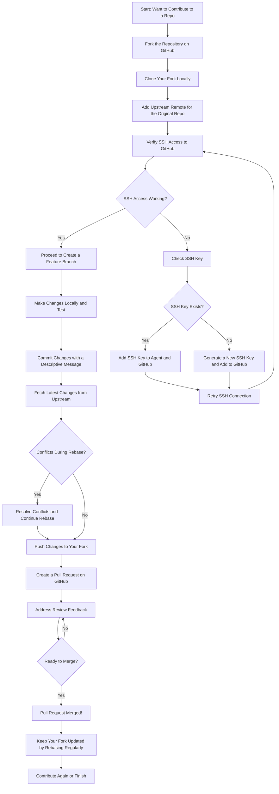

# Git Contribution

```mermaid
graph TD
    A[Start: Want to Contribute to a Repo] --> B[Fork the Repository on GitHub]
    B --> C[Clone Your Fork Locally]
    C --> D[Add Upstream Remote for the Original Repo]
    D --> E[Verify SSH Access to GitHub]
    
    E --> F{SSH Access Working?}
    F -->|Yes| G[Proceed to Create a Feature Branch]
    F -->|No| H[Check SSH Key]
    
    H --> I{SSH Key Exists?}
    I -->|Yes| J[Add SSH Key to Agent and GitHub]
    I -->|No| K[Generate a New SSH Key and Add to GitHub]
    J --> L[Retry SSH Connection]
    K --> L[Retry SSH Connection]
    L --> E

    G --> M[Make Changes Locally and Test]
    M --> N[Commit Changes with a Descriptive Message]
    N --> O[Fetch Latest Changes from Upstream]
    
    O --> P{Conflicts During Rebase?}
    P -->|Yes| Q[Resolve Conflicts and Continue Rebase]
    P -->|No| R[Push Changes to Your Fork]
    Q --> R
    
    R --> S[Create a Pull Request on GitHub]
    S --> T[Address Review Feedback]
    T --> U{Ready to Merge?}
    U -->|Yes| V[Pull Request Merged!]
    U -->|No| T
    
    V --> W[Keep Your Fork Updated by Rebasing Regularly]
    W --> X[Contribute Again or Finish]
```

---

- [Git MERGE vs REBASE: Everything You Need to Know](https://www.youtube.com/watch?v=0chZFIZLR_0)
